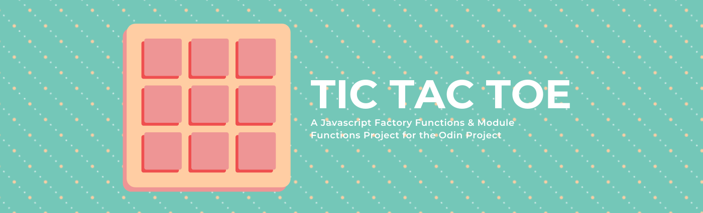
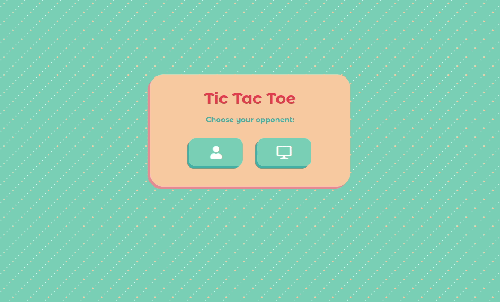

# Tic Tac Toe
A Tic Tac Toe browser game created for [the Odin Project Ruby on Rails Course](https://www.theodinproject.com/courses/javascript/lessons/tic-tac-toe-javascript) to learn how to use factory functions and module functions. 

## Features 
User are able to play Tic Tac Toe against another player or the computer. The players can input their names and see when their turn is on the left side. If they wish to restart the game with the same players, they can use the reset button. If they'd like to try a different mode or play against a different player, they can select the menu button to go back to the initial selection screen. The game keeps track of who wins and whether it ends in a tie. 

## Demo 
Check out the live version [here](https://zxum.github.io/tic-tac-toe-js/)

## Reflections 
I was so nervous starting this project, mainly because factory functions and modules look so different than what I'm used to. I started out with the things I had a good grasp on, such as setting up the HTML and CSS styles. Then I created my three main module functions for the game board, the player input and the menu. I kept the DOM captures and event binding separate from my functions and it helped keep the functions narrow. 

I still have a lot to learn about Object Oriented Programming with Javascript, but I am now more confident on how to create factory functions and module functions. 